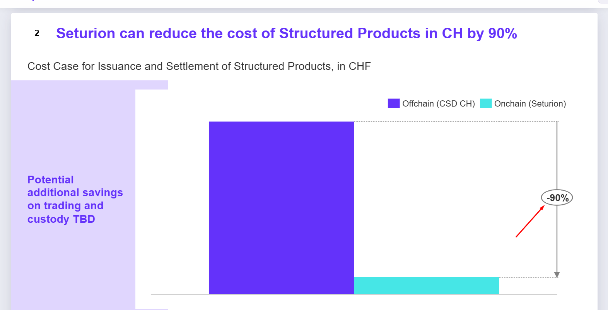

# BXD 1 — React + Tailwind

The Boerse Stuttgart **BXD Sales-Driven Growth Strategy** deck as a React app.
Scrolls like a web page; every slide is a faithful copy of the PowerPoint slide —
same geometry, same font sizes, same colours.

```bash
npm install
npm run dev       # http://localhost:5173
npm run build     # -> dist/
npm run preview
```




Two pages, one deck:

| page | shows |
|---|---|
| `index.html` | the 17 generated slides — the deck as PowerPoint has it |
| `self-assist.html` | 16 slides: the same deck with the two dense ones swapped for their interactive re-cuts |

## The one rule that matters

**Slide bodies are generated markup and are mounted as HTML, not rebuilt as
components.** `src/deck/slides.js` is a build artifact: a Python renderer reads
the OOXML out of the source `.pptx` and emits absolutely-positioned shapes whose
every position, size, colour and font size is the value PowerPoint stored. That
is the whole reason this deck matches the original. Re-expressing those shapes as
JSX would mean re-deriving thousands of numbers, and the first rounding
disagreement is a visible bug.

So `<Stage>` sets the slide body with `dangerouslySetInnerHTML`. The content is a
local build artifact, not user input.

Everything the deck's own layers need is addressed by class:

| class | who needs it |
|---|---|
| `.slidewrap` | `extra.js` stamps a hand-authored slide's page number through it |
| `.slide` | the stylesheet hangs the primitives and the interaction layer off it; `interact.js` collects slides by it |
| `.anim` / `.seen` | the entrance — `.seen` is added when a slide is reached, and every per-shape delay is measured from that moment |

The wrapper's **first child must be the stage**: the scaler and the reveal
observer both take `firstChild`.

## Where Tailwind is, and where it is not

Tailwind styles everything React renders: the navbar, the slide menu, the dot
rail, the progress bar, the badges, the hint. Utilities cannot reach inside a
string of markup, so two stylesheets remain, and they are not a shortcut:

| file | what it styles |
|---|---|
| `src/styles/deck.css` | the generated shapes — `.sp` / `.gp` / `.tx` / `.tbl` — plus the whole interaction and entrance layer, and the tooltip `interact.js` drives by id |
| `src/styles/_extra-slides.css` | the two hand-authored slides (`.gtm-*`, `.htw-*`), whose markup is also built as strings |

They are imported after Tailwind in `src/main.jsx`, so a rule that styles
generated markup outranks Preflight on a tie.

### Two things Preflight does that had to be undone

Both were caught by diffing element geometry against the static build, and both
are commented where they are fixed, in `deck.css`:

- `img{max-width:100%}` — a picture that came out of a pptx **group** is
  positioned inside `.gpi`, which is `position:relative`, so "100%" is the width
  of the *group*. Every logo wider than its own group was silently squeezed: the
  Fidelity mark on slide 16 came out 16px wide instead of 126px.
- `html{line-height:1.5}` — the generated slides are immune, because the
  renderer writes every paragraph's line-height in absolute px. The two
  hand-authored slides size their rows in px and let the text inherit `normal`,
  so the taller line box pushed every partner logo and label down by up to 3.5px.

## Layout

```
src/
  App.jsx                 chrome + running order (order comes in as a prop)
  main.jsx                entry for index.html
  main-self-assist.jsx    entry for self-assist.html
  components/
    Navbar.jsx            brand, current title, prev/next, slide menu
    Rail.jsx              dot rail; each dot names its slide on hover
    Stage.jsx             one mounted slide
  deck/
    slides.js             GENERATED from the pptx — never hand-edit
    htw.js                GENERATED — data for the How-to-win re-cut
    extra.js              the two hand-authored slides + their wiring
    interact.js           the interaction layer: units, hover, reveal, tooltips
    useDeck.js            the engine: running order, scale-to-fit, observers,
                          keyboard, and the one-shot hook that runs the two
                          imperative layers after mount
  styles/
    index.css             Tailwind directives
    deck.css              see above
    _extra-slides.css     see above
public/assets/            images extracted from the pptx
```

`interact.js` and `extra.js` are imperative: they read the mounted markup and
attach behaviour to it. `useInteractions` runs them **once**, after the slides
are in the DOM. `src/main.jsx` deliberately does **not** use `StrictMode` — it
double-invokes effects in development, and the interaction layer mutates the
markup (a tint plate per unit, pointer handlers), so running it twice doubles
everything.

## Fidelity

Checked against the static build it was ported from, at 1600×900:

- **element geometry** — all 1185 elements on `index.html`, and all 958 on
  `self-assist.html`, within 0.6px.
- **pixels** — deck mean below 0.01/255 per channel, which is at the
  rasterisation noise floor (the static build compared against *itself* across
  two loads scores in the same range).
- **behaviour** — the interaction layer's own inventory (`window.__IX`, what it
  made interactive per slide) is byte-identical, and the repo's suites pass
  unchanged: 30/30 interactions, 37/37 hand-authored slides.

To regenerate the slides, change the renderer in the original repo
(`tools/render.py`) and copy `slides.js` / `htw.js` across, adding the `export`
keyword. They are build artifacts; do not edit them by hand.
